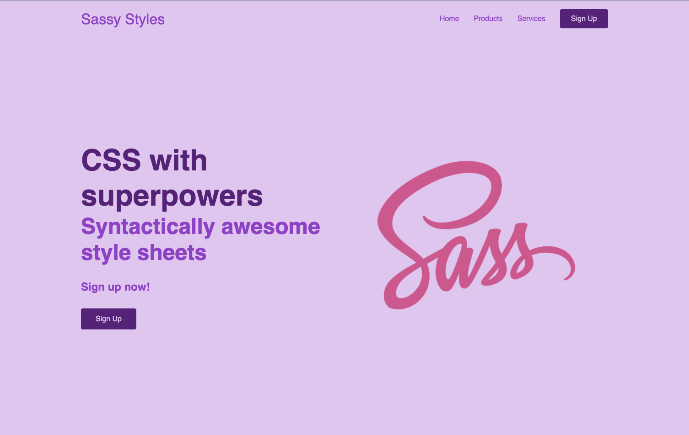
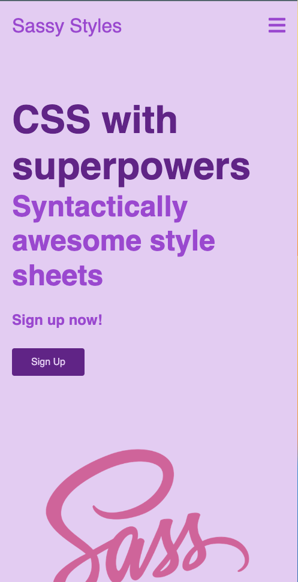

# sassy-styling
This is a demo project to learn improving css using sass

To run it on browser use [live-server](https://marketplace.visualstudio.com/items?itemName=ritwickdey.LiveServer) vscode extension

---
### Here are some of the problems we want to solve:
- **Problem 1**: No Naming convention
- **Problem 2**: Difficult to update properties like colors in all places
- **Problem 3**: Font sizes don't support accessibility
- **Problem 4**: Difficult to read
- **Problem 5**: Difficult to maintain or collaborate
- **Problem 6**: Code duplication
- **Problem 7**: Unnecessary repetition of media queries
- **Problem 8**: Soo used to thinking in px, need a rem convertor
- **Problem 9**: Unable to switch theme

---

>The final code can be found in final branch

Here's how the website look:

